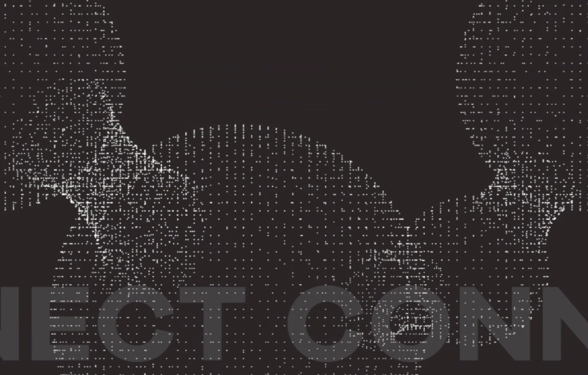

# パフォーマンス最適化ガイド

## 🎯 現在の問題点

1. **画像が重い**
   - `project-gene-background.png`: 1.3MB
   - `hero-background.png`: 1.0MB
   - `shu.png`: 220KB

2. **CSSが大きい**
   - `styles-consolidated.css`: 146KB
   - 複数のCSSファイルが存在

3. **JavaScriptの読み込み**
   - 同期的な読み込みでレンダリングブロック

## ✅ 最適化手順

### 1. 画像の最適化（最優先）

```bash
# オンラインツールを使用
# https://squoosh.app/ または https://tinypng.com/

# 推奨設定:
# - WebP形式: 品質85%
# - JPEG形式（フォールバック）: 品質85%、プログレッシブ
# - モバイル用: 幅768px以下
```

### 2. HTML修正 - 画像の遅延読み込み

```html
<!-- 現在のコード -->


<!-- 最適化後 -->
<picture class="hero-background-layer">
    <source srcset="images/hero-bg.webp" type="image/webp">
    <source srcset="images/hero-bg-mobile.webp" type="image/webp" media="(max-width: 768px)">
    
</picture>
```

### 3. CSS最適化

```css
/* Critical CSS (インライン化) - ファーストビューのみ */
<style>
* { margin: 0; padding: 0; box-sizing: border-box; }
.header { /* ヘッダーの最小限スタイル */ }
.hero-section { /* ヒーローセクションの最小限スタイル */ }
</style>

/* その他のCSSは非同期読み込み */
<link rel="preload" href="styles.min.css" as="style" onload="this.onload=null;this.rel='stylesheet'">
```

### 4. JavaScript最適化

```html
<!-- defer属性を追加 -->
<script src="translations.js" defer></script>
<script src="language-switcher.js" defer></script>
<script src="mobile-menu.js" defer></script>
```

### 5. 不要なファイルの削除

削除推奨:
- test-*.html
- *-backup.html
- 未使用のCSSファイル
- 重複した画像ファイル

## 📊 期待される改善

- **初期表示時間**: 3秒 → 1秒以下
- **ファイルサイズ削減**: 約70%削減
- **Lighthouse スコア**: 
  - Performance: 60 → 90+
  - Best Practices: 85 → 95+

## 🚀 実装優先順位

1. **画像をWebP形式に変換**（効果: 大）
2. **Critical CSSのインライン化**（効果: 大）
3. **JavaScript遅延読み込み**（効果: 中）
4. **不要ファイル削除**（効果: 小）

## 🛠️ 簡単な実装方法

1. 画像を https://squoosh.app/ で変換
2. index.htmlの画像タグを<picture>タグに置換
3. script タグに defer 属性を追加
4. 未使用ファイルを .gitignore に追加